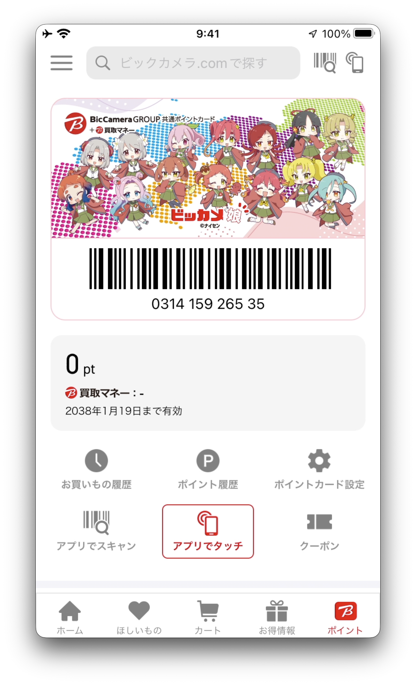
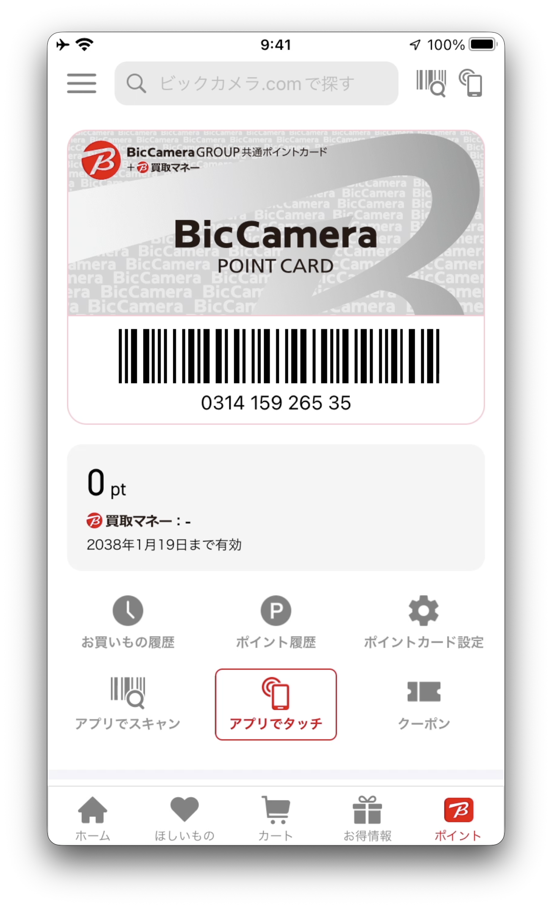

# BicSkin

An iOS tweak for **BicCamera** (`com.biccamera.ios.mobile.BicCamera`) that lets you flip the point card on screen with a double-tap — swap between your real card and a bundled placeholder so you can share screenshots of the app without leaking your card number or barcode.

## Demo

Double-tap the card to flip between your real point card and the bundled placeholder:

| Real card | Placeholder (`pointcard_default`) |
|:---:|:---:|
|  |  |

The card number, balance, and barcode above are dummy values (`0314 159 265 35`) injected by the `DEBUG`-only screenshot mode — nothing real gets exposed in these captures.

Full 3D flip animation:

<div align="center">
  <video src="docs/demo.mov" controls muted playsinline width="320"></video>
</div>

If the inline player doesn't render for you, download [docs/demo.mov](docs/demo.mov) and open it locally.

## Features

- **Double-tap card flip.** Toggle between the real point card image and a bundled placeholder with a smooth 3D flip. Implemented via manual `CATransform3D` rotation so the card's rounded corners are preserved throughout the animation — unlike `UIViewAnimationOptionTransitionFlip*`, which snapshots the layer and drops the mask mid-flip.
- **Card + barcode only.** The flip is scoped to the card image and its barcode strip — the point balance row below stays readable during the animation.
- **Cross-injection safe.** Works whether the dylib is injected via MobileSubstrate (`.deb` on a jailbroken device) or embedded into the app bundle via a jailed IPA (Sideloadly / TrollStore). A process-wide install marker prevents both paths from cancelling each other out when they end up loaded together (`method_exchangeImplementations` is self-inverse).
- **Screenshot-friendly DEBUG mode.** Debug builds swizzle `NSJSONSerialization` to inject a dummy card number, balance, barcode, and point history — handy for capturing feature screenshots without a real account. Fully stripped by `FINALPACKAGE=1`.

## Install

### Jailbroken (Dopamine / palera1n / …)

Grab the latest `.deb` from the Releases page and install it via Sileo or Zebra, or push it to the device manually:

```
scp com.tkgstrator.bicskin_*.deb mobile@<device>:/tmp/
ssh mobile@<device> sudo dpkg -i /tmp/com.tkgstrator.bicskin_*.deb
```

### Sideloadly / TrollStore

Grab the pre-patched IPA from the Releases page and install it with TrollStore or Sideloadly. No jailbreak required.

## Build from source

Requires [Theos](https://theos.dev/) and the vendored deps under `vendor/` (`fishhook` for all builds, `Dobby` for jailed builds). A Devcontainer with the full toolchain is included — open the repo in VS Code and it will provision everything.

```
# Jailbroken rootless .deb, installed to $THEOS_DEVICE_IP
make package install

# Jailed IPA (drop a decrypted BicCamera IPA under assets/ first)
make deploy
```

The full target list is documented at the top of the [Makefile](Makefile).

## Layout

| Path | What |
|---|---|
| `Sources/BicSkin/Tweak.m` | The tweak — plain Objective-C, no `.x` / logos. |
| `Makefile` | Project-agnostic Theos template driven off `control` + `Tweak.plist`. |
| `vendor/` | Pinned copies of `fishhook` and `Dobby`. |
| `frida/` | TypeScript Frida agent used during reverse engineering. |
| `assets/` | Drop your decrypted BicCamera IPA here (gitignored). |
| `docs/` | Demo assets shown in this README. |

## Notes

BicSkin is a personal project and isn't affiliated with BicCamera / Bic Camera Inc. Use at your own risk.
